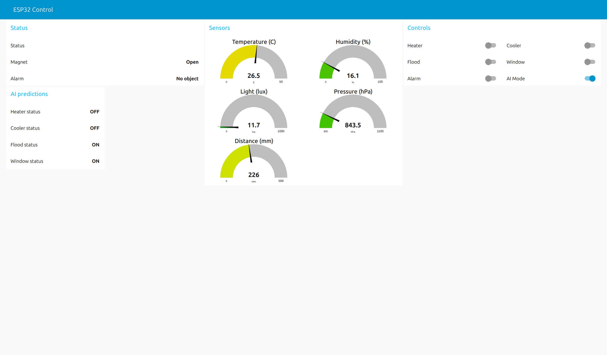
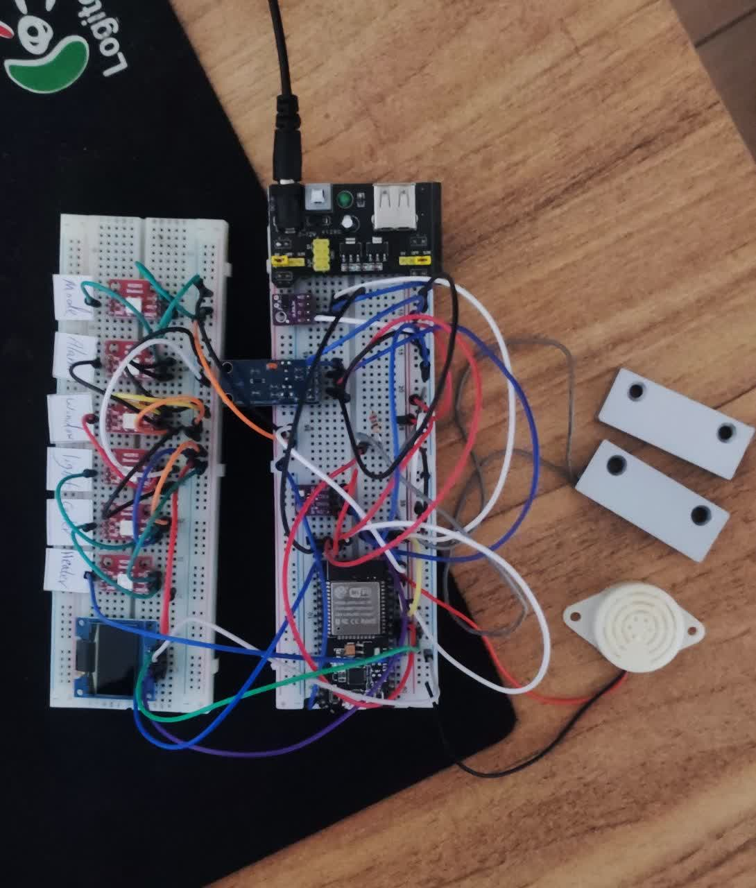

# IoT-DigitalTwin-ML-Pipeline
ESP32 → MQTT (Mosquitto) → ML Inference → Node-RED Dashboard

## Quick start
- MQTT broker: localhost:1883
- Topic in: `iot/model/input`
- Topic out: `iot/model/predictions`

Run one model server:
```bash
python3 -m venv .venv
source .venv/bin/activate
pip install -r ml_pipeline/requirements.txt
python ml_pipeline/models/decision_tree/server_tree.py
# or: python ml_pipeline/models/neural_network/server_neural_network.py
```

Node-RED: import `node_red_dashboard/flow.json` and open the dashboard.
ESP32 firmware: `esp32_code/main/main.ino`

## Docs
- Node-RED: node_red_dashboard/README.md
- MQTT examples: docs/mqtt_examples.md

## Screenshots
### Dashboard


### Hardware / Circuit


- Hardware/Wiring: docs/hardware.md

## Hardware note
Sensors: BME280 (temp/humidity/pressure) + BH1750 (light) over I2C. ESP32 default I2C pins: SDA=21, SCL=22.
