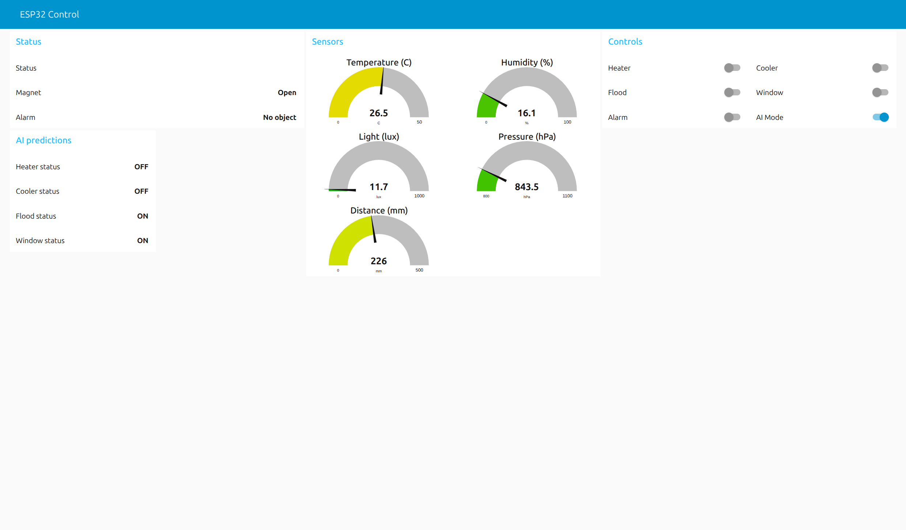
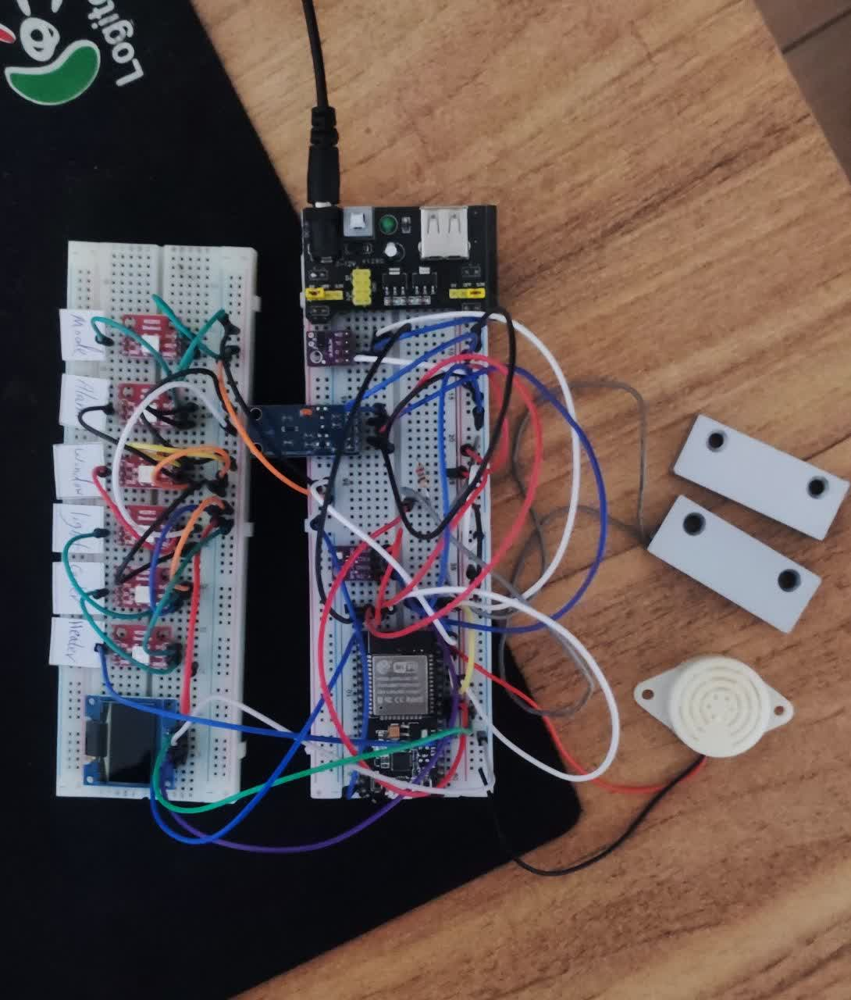

# IoT Digital Twin ML Pipeline

IoT-based digital twin pipeline combining ESP32 sensing, MQTT communication, machine learning inference, and a Node-RED dashboard for monitoring and decision support.

This project demonstrates an end-to-end prototype that connects:

- embedded sensing
- IoT communication
- MQTT messaging
- machine learning inference
- dashboard-based visualization
- digital twin style monitoring

The full system pipeline is:

```text
ESP32 sensors → MQTT broker → ML inference layer → Node-RED dashboard
```

---

## Project Overview

The system is built around an ESP32-based sensing unit that collects environmental data from physical sensors and sends the readings through MQTT.

The received data can then be processed by machine learning models, and the resulting predictions are visualized in a Node-RED dashboard.

This project is designed as a practical IoT / embedded AI pipeline for environmental monitoring and decision support.

---

## Why This Project Matters

This project connects several important parts of an intelligent cyber-physical system:

- sensor data collection from real hardware
- communication between embedded devices and software services
- MQTT-based message passing
- model-based prediction
- dashboard visualization
- digital twin style monitoring

It complements my other projects in TinyML, dynamic systems, Kalman filtering, and sensor-based classification by showing a broader IoT system architecture.

---

## System Architecture

The system consists of four main layers:

```text
ESP32 Sensing Layer
        ↓
MQTT Communication Layer
        ↓
Machine Learning Layer
        ↓
Node-RED Dashboard Layer
```

---

## Main Components

### 1. ESP32 Sensing Layer

The ESP32 collects real-world environmental data from:

- BME280 temperature, humidity, and pressure sensor
- BH1750 ambient light sensor

The sensors communicate with the ESP32 over I2C.

Default ESP32 I2C pins:

```text
SDA: GPIO 21
SCL: GPIO 22
```

The ESP32 firmware is located in:

```text
esp32_code/main/main.ino
```

---

### 2. MQTT Communication Layer

Sensor data is transmitted using MQTT.

Default broker:

```text
localhost:1883
```

Main MQTT topics:

| Topic | Purpose |
|---|---|
| `iot/model/input` | Input data sent to the model layer |
| `iot/model/predictions` | Model prediction output |
| `iot/test/sensors` | Sensor data stream |
| `iot/cmd/act` | Control or actuator command topic |

MQTT examples are documented in:

```text
docs/mqtt_examples.md
```

---

### 3. Machine Learning Layer

The machine learning pipeline is located in:

```text
ml_pipeline/
```

The project includes trained model artifacts and pipeline documentation for intelligent prediction behavior.

The ML layer supports model-based decision making using approaches such as:

- decision tree models
- neural network models
- preprocessing / scaling pipeline

Important files include:

```text
ml_pipeline/README.md
ml_pipeline/requirements.txt
ml_pipeline/models/
```

---

### 4. Node-RED Dashboard Layer

The system uses Node-RED to visualize incoming data and prediction outputs.

The dashboard flow is included in:

```text
node_red_dashboard/flow.json
```

Dashboard setup documentation is available in:

```text
node_red_dashboard/README.md
```

---

## Dashboard and Hardware Screenshots

### Node-RED Dashboard

The dashboard visualizes the IoT data stream and model outputs.



### Hardware and Circuit

The hardware setup connects the ESP32 with environmental sensors for real-world data collection.



---

## Repository Structure

```text
IoT-DigitalTwin-ML-Pipeline/
├── docs/
│   ├── hardware.md
│   ├── mqtt_examples.md
│   ├── presentation.pdf
│   └── images/
│       ├── dashboard.png
│       └── circuit.jpeg
├── esp32_code/
│   ├── config.h.template
│   ├── README.md
│   └── main/
│       └── main.ino
├── ml_pipeline/
│   ├── README.md
│   ├── requirements.txt
│   └── models/
├── node_red_dashboard/
│   ├── flow.json
│   └── README.md
├── LICENSE
└── README.md
```

---

## Documentation

Additional documentation is available in:

| Document | Description |
|---|---|
| [`docs/hardware.md`](docs/hardware.md) | Hardware setup and sensor information |
| [`docs/mqtt_examples.md`](docs/mqtt_examples.md) | MQTT topic examples and message format |
| [`esp32_code/README.md`](esp32_code/README.md) | ESP32 firmware notes |
| [`ml_pipeline/README.md`](ml_pipeline/README.md) | Machine learning pipeline notes |
| [`node_red_dashboard/README.md`](node_red_dashboard/README.md) | Node-RED dashboard setup |
| [`docs/presentation.pdf`](docs/presentation.pdf) | Project presentation |

---

## Quick Start

### 1. ESP32 Firmware

The ESP32 firmware entry point is:

```text
esp32_code/main/main.ino
```

Before uploading the firmware, create a local configuration file from the template:

```text
esp32_code/config.h.template
```

Do not commit real WiFi credentials.

---

### 2. ML Environment

Go to the ML pipeline folder:

```bash
cd ml_pipeline
```

Create and activate a virtual environment:

```bash
python3 -m venv .venv
source .venv/bin/activate
```

Install dependencies:

```bash
pip install -r requirements.txt
```

Then run the relevant model or inference scripts described in:

```text
ml_pipeline/README.md
```

---

### 3. Node-RED Dashboard

Import the Node-RED flow from:

```text
node_red_dashboard/flow.json
```

Dashboard details are documented in:

```text
node_red_dashboard/README.md
```

---

## Configuration and Security Note

Real WiFi credentials and local network settings should not be committed to Git.

This repository includes:

```text
esp32_code/config.h.template
```

Local configuration files such as the following are ignored by Git:

```text
esp32_code/config.h
esp32_code/main/config.h
```

This keeps private WiFi credentials and local broker IP addresses out of the public repository.

---

## Project Role in Portfolio

This project represents the IoT and digital twin side of my portfolio.

It complements other projects focused on:

- embedded TinyML condition monitoring
- Kalman filtering for dynamic systems
- machine learning classification of simulated physical systems
- graph mining and node classification

Together, these projects support a broader direction:

```text
AI / ML for intelligent physical and sensor-based systems
```

---

## Project Goal

The main goal of this project is to create an intelligent digital twin pipeline for environmental monitoring and decision support by combining:

- embedded systems
- IoT communication
- machine learning
- MQTT-based data exchange
- dashboard-based visualization

---

## Limitations

This project is a prototype and has several limitations:

- the system is designed for local network testing
- deployment structure can be improved
- model serving can be made more robust
- logging and evaluation can be expanded
- dashboard control features are still basic
- cloud deployment is not included in the current version

These limitations leave clear room for future extensions.

---

## Future Improvements

Possible next steps:

- improve deployment structure
- add more robust model serving
- improve model evaluation and logging
- extend the dashboard with richer control features
- connect the system to cloud infrastructure
- add more sensors and actuator feedback
- improve reproducibility of the ML pipeline

---

## Summary

This project demonstrates a practical IoT digital twin pipeline that connects real embedded sensing with MQTT communication, machine learning inference, and dashboard visualization.

It is a portfolio-oriented example of how embedded devices, ML systems, and monitoring dashboards can work together in an intelligent cyber-physical system.
