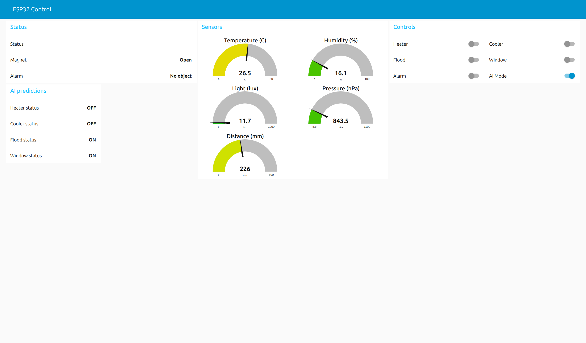
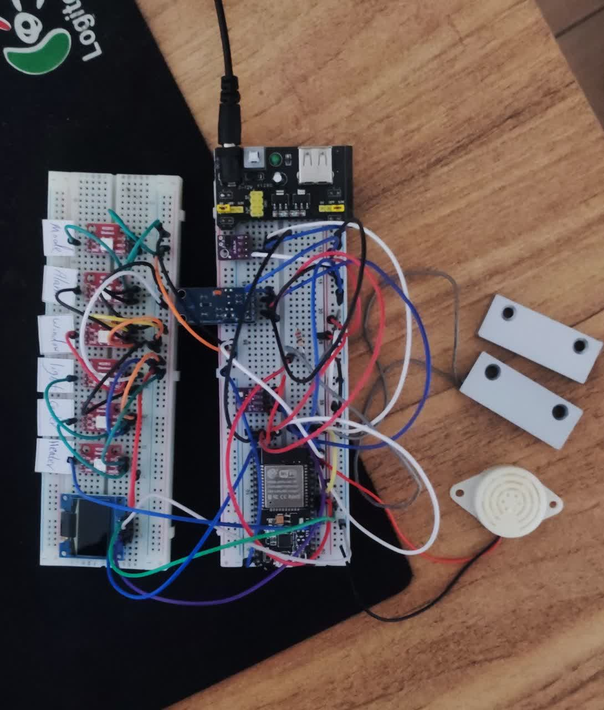

# IoT Digital Twin ML Pipeline

I built this project as an end-to-end local IoT pipeline: an ESP32 reads physical sensors, sends data over MQTT, the software layer handles model-side decisions, and Node-RED shows the system state on a dashboard.

The useful part of this project is that it connects several pieces that are often shown separately. The hardware, MQTT topics, ML artifacts, and dashboard are all part of the same prototype, so it is closer to a small cyber-physical system than a standalone ML notebook.

Current pipeline:

- ESP32 sensor node
- BME280, BH1750, VL53L0X, and reed-switch inputs
- MQTT message passing
- ML / decision layer
- Node-RED dashboard
- local configuration kept out of Git

One practical issue I had to handle was separating public project files from local network settings. The repository includes configuration templates, while real WiFi credentials and local broker details stay untracked.

---

## What I built

The system is built around an ESP32-based sensing unit that collects environmental data and simple physical-state inputs, then publishes the readings through MQTT.

The software side receives those readings, connects them with model-side decision logic, and visualizes the result in a Node-RED dashboard.

This is still a prototype, but the main value is the integration path: sensor data does not stay inside a script; it moves through an embedded and networked pipeline.

---

## System Architecture

The system consists of four main layers:

```text
ESP32 Sensing and State Layer
        ↓
MQTT Communication Layer
        ↓
Machine Learning / Decision Layer
        ↓
Node-RED Digital Twin Dashboard Layer
```

In the current prototype, the sensing layer includes both environmental measurements and simple physical-state inputs, including distance and magnetic door/window status.

---

## Main Components

### 1. ESP32 Sensing Layer

The ESP32 collects environmental and physical-state readings from:

- BME280 temperature, humidity, and pressure sensor
- BH1750 ambient light sensor
- VL53L0X time-of-flight distance sensor
- magnetic reed switch used as a door/window contact sensor

The BME280, BH1750, and VL53L0X communicate with the ESP32 over I2C. The reed switch is connected as a digital input and is used to represent a simple door/window state.

Default ESP32 I2C pins:

```text
SDA: GPIO 21
SCL: GPIO 22
```

The ESP32 firmware is located in:

```text
esp32_code/main/main.ino
```

---

### 2. MQTT Communication Layer

Sensor data is transmitted using MQTT.

Default broker:

```text
localhost:1883
```

Main MQTT topics:

| Topic | Purpose |
|---|---|
| `iot/model/input` | Input data sent to the model layer |
| `iot/model/predictions` | Model prediction output |
| `iot/test/sensors` | Sensor data stream including environmental values, magnet state, distance, and alarm state |
| `iot/cmd/act` | Control or actuator command topic |

MQTT examples are documented in:

```text
docs/mqtt_examples.md
```

---

### 3. Machine Learning Layer

The machine learning pipeline is located in:

```text
ml_pipeline/
```

The repository includes trained model artifacts and notes for how the ML layer is used inside the local IoT pipeline.

The ML layer supports model-based decision making using approaches such as:

- decision tree models
- neural network models
- preprocessing / scaling pipeline

Important files include:

```text
ml_pipeline/README.md
ml_pipeline/requirements.txt
ml_pipeline/models/
```

---

### 4. Node-RED Dashboard Layer

The system uses Node-RED to visualize incoming data and prediction outputs.

The dashboard flow is included in:

```text
node_red_dashboard/flow.json
```

Dashboard setup documentation is available in:

```text
node_red_dashboard/README.md
```

---

## Dashboard and Hardware Screenshots

### Node-RED Dashboard

The dashboard visualizes the IoT data stream and model outputs.



### Hardware and Circuit

The hardware setup connects the ESP32 with environmental sensors used by the local pipeline.



---

## Repository Structure

```text
IoT-DigitalTwin-ML-Pipeline/
├── docs/
│   ├── hardware.md
│   ├── mqtt_examples.md
│   ├── presentation.pdf
│   └── images/
│       ├── dashboard.png
│       └── circuit.jpeg
├── esp32_code/
│   ├── config.h.template
│   ├── README.md
│   └── main/
│       └── main.ino
├── ml_pipeline/
│   ├── README.md
│   ├── requirements.txt
│   └── models/
├── node_red_dashboard/
│   ├── flow.json
│   └── README.md
├── LICENSE
└── README.md
```

---

## Documentation

Additional documentation is available in:

| Document | Description |
|---|---|
| [`docs/hardware.md`](docs/hardware.md) | Hardware setup and sensor information |
| [`docs/mqtt_examples.md`](docs/mqtt_examples.md) | MQTT topic examples and message format |
| [`esp32_code/README.md`](esp32_code/README.md) | ESP32 firmware notes |
| [`ml_pipeline/README.md`](ml_pipeline/README.md) | Machine learning pipeline notes |
| [`node_red_dashboard/README.md`](node_red_dashboard/README.md) | Node-RED dashboard setup |
| [`docs/presentation.pdf`](docs/presentation.pdf) | Project presentation |

---

## Quick Start

### 1. ESP32 Firmware

The ESP32 firmware entry point is:

```text
esp32_code/main/main.ino
```

Before uploading the firmware, create a local configuration file from the template:

```text
esp32_code/config.h.template
```

Do not commit real WiFi credentials.

---

### 2. ML Environment

Go to the ML pipeline folder:

```bash
cd ml_pipeline
```

Create and activate a virtual environment:

```bash
python3 -m venv .venv
source .venv/bin/activate
```

Install dependencies:

```bash
pip install -r requirements.txt
```

Then run the relevant model or inference scripts described in:

```text
ml_pipeline/README.md
```

---

### 3. Node-RED Dashboard

Import the Node-RED flow from:

```text
node_red_dashboard/flow.json
```

Dashboard details are documented in:

```text
node_red_dashboard/README.md
```

---

## Configuration and Security Note

Real WiFi credentials and local network settings should not be committed to Git.

This repository includes:

```text
esp32_code/config.h.template
```

Local configuration files such as the following are ignored by Git:

```text
esp32_code/config.h
esp32_code/main/config.h
```

This keeps private WiFi credentials and local broker IP addresses out of the public repository.

---

## What is real in the current prototype

The current repository includes the real ESP32 firmware, MQTT topic structure, Node-RED dashboard flow, model artifacts, and project documentation.

The system is local-first. It is meant for local testing with an MQTT broker and Node-RED dashboard, not cloud deployment.

A few parts are still prototype-level:

- model serving is not packaged as a production service
- logging and evaluation can be improved
- dashboard control features are basic
- cloud deployment is not included
- actuator feedback is still limited

That separation matters because the project is strongest as a system-integration prototype, not as a finished industrial digital twin.

---

## Limitations

This project is a prototype and has several limitations:

- the system is designed for local network testing
- deployment structure can be improved
- model serving can be made more reliable
- logging and evaluation can be expanded
- dashboard control features are still basic
- cloud deployment is not included in the current version

These limitations leave clear room for future extensions.

---

## Future Improvements

Possible next steps:

- improve deployment structure
- add more reliable model serving
- improve model evaluation and logging
- extend the dashboard with richer control features
- connect the system to cloud infrastructure
- add more sensors and actuator feedback
- improve reproducibility of the ML pipeline

---

## Summary

This repository shows a practical local IoT pipeline that connects real embedded sensing with MQTT communication, model-side decisions, and dashboard visualization.

The main lesson from this project is integration: embedded sensing, messaging, model logic, and dashboard feedback have to agree on data format and system state.
